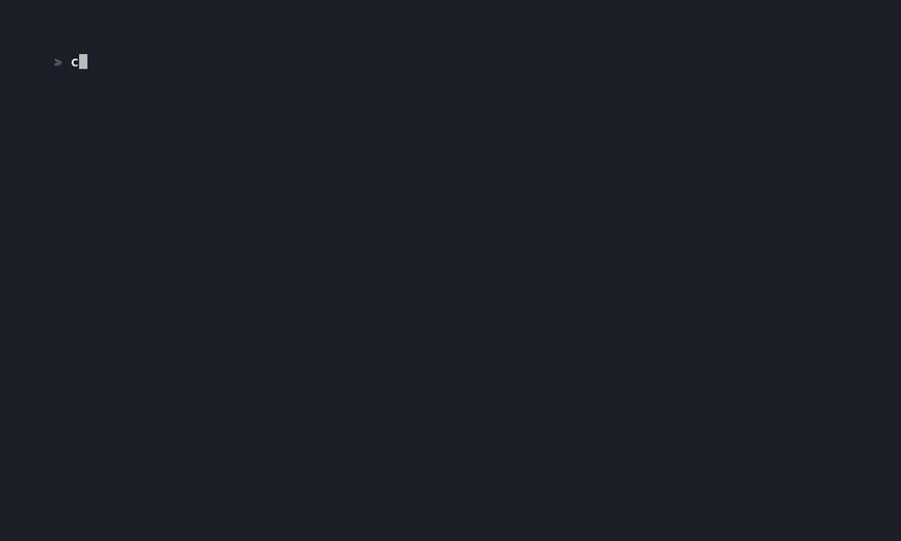

# quantedge-ta-example

A runnable showcase of the [`quantedge-ta`](../README.md) streaming technical
analysis library. Connects to Binance, streams live BTC/USDT klines, and prints
an SMA(20) value that updates on every tick — including intra-bar repaints.

## What it demonstrates

- **Plain-struct bar input** — Binance klines are parsed into `Ohlcv` values
  (`src/binance_client.rs`: `kline_to_ohlcv` / `summary_to_ohlcv`). The
  iterator yields `Ohlcv` directly; no trait impl required.
- **Warm-up via `convergence()`** — the historical fetch size is driven by
  `config.convergence()` so the indicator is already producing values when the
  live stream takes over.
- **Live repainting** — Binance emits ~150 kline snapshots per 5m bar, all
  sharing the same `open_time`. `Sma::compute()` replaces the current bar's
  contribution on each repaint and advances the window only when `open_time`
  changes.
- **O(1) per tick** — `compute()` is called once per websocket event, no
  re-scanning.

## Run

```bash
cargo run
```

Output (one line per kline event, including repaints):



```
26.04.15 22:34:58> open time: 26.04.15 22:30:00, price: 74552.50: sma: 74736.10
26.04.15 22:35:00> open time: 26.04.15 22:30:00, price: 74553.99: sma: 74736.18
26.04.15 22:35:02> open time: 26.04.15 22:35:00, price: 74561.26: sma: 74714.11
26.04.15 22:35:04> open time: 26.04.15 22:35:00, price: 74570.11: sma: 74714.55
```

Regenerate the GIF with [`vhs`](https://github.com/charmbracelet/vhs):

```bash
vhs demo.tape
```

`Ctrl+C` shuts down the websocket and exits cleanly.

## Configuration

The example is hardcoded to `BTCUSDT` on the `5m` interval with
`SmaConfig::default()` (SMA(20) over Close). Adjust in `src/main.rs`:

- Change symbol/interval — modify the `stream_binance_klines(...)` call
- Swap indicator — replace `Sma`/`SmaConfig` with any other indicator exported
  from `quantedge_ta` (EMA, RSI, BB, MACD, ATR, …)

## Layout

| File                    | Purpose                                              |
|-------------------------|------------------------------------------------------|
| `src/main.rs`           | Wires the stream through `Sma::compute()`            |
| `src/binance_client.rs` | Historical REST fetch + live websocket, emitting `Ohlcv` |
| `src/utils.rs`          | SIGINT handler and formatted output                  |
